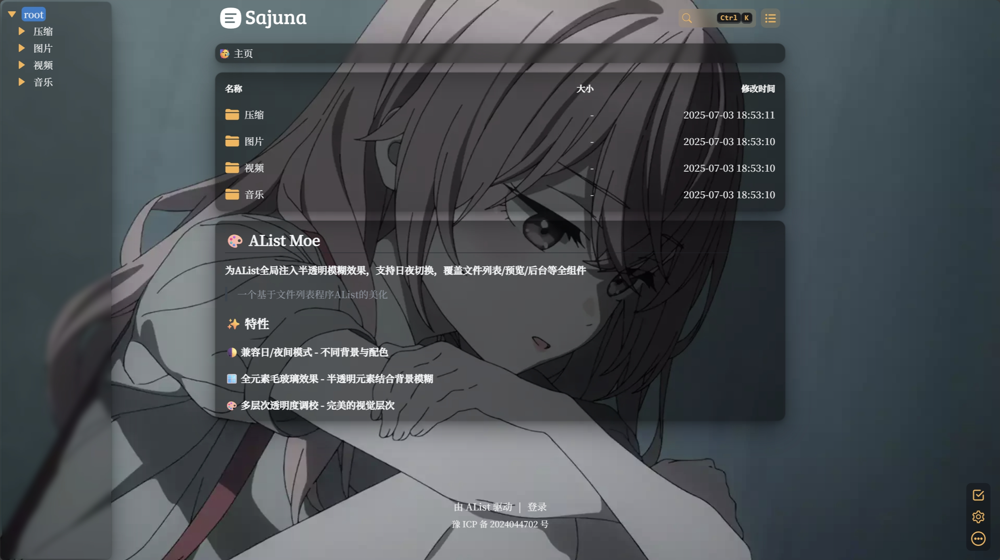
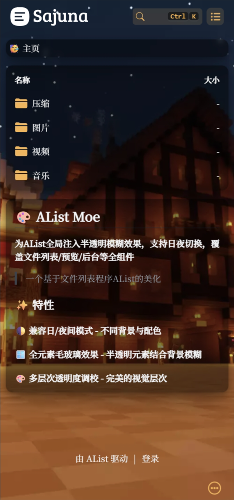
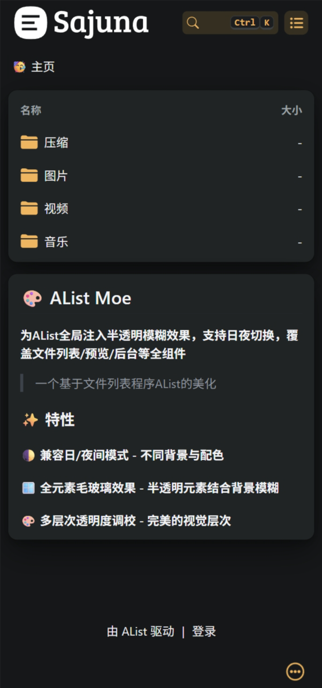
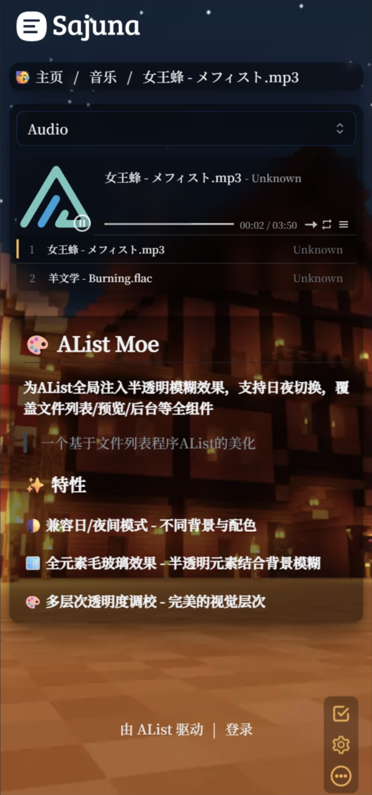
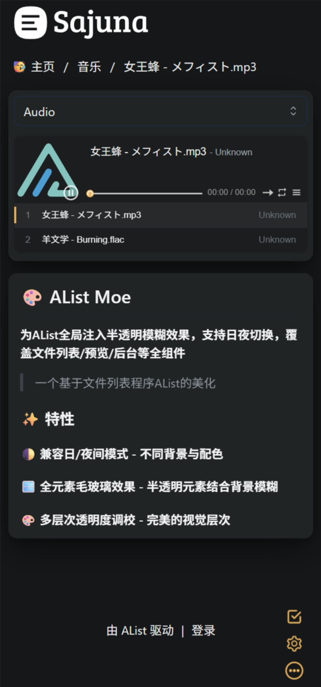
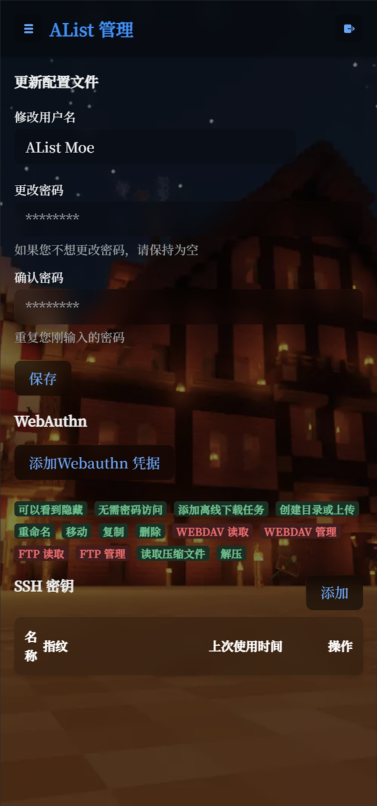
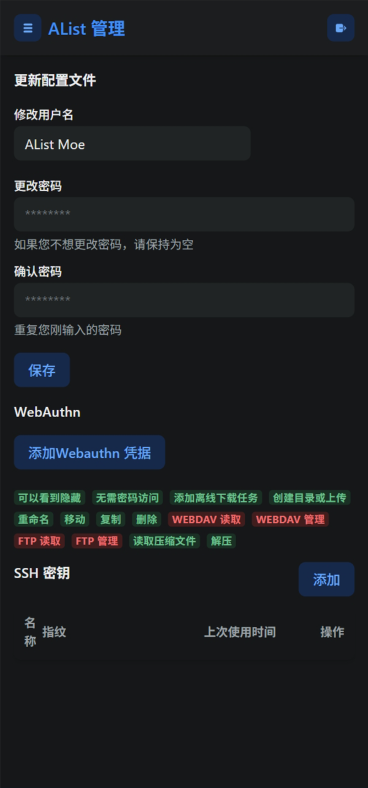
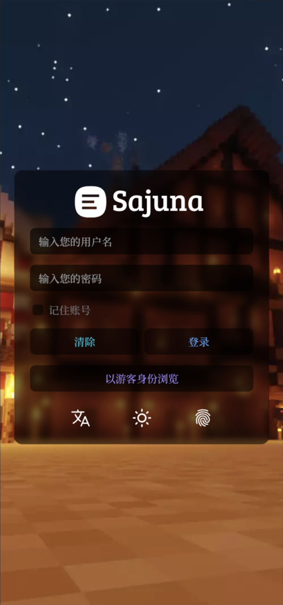
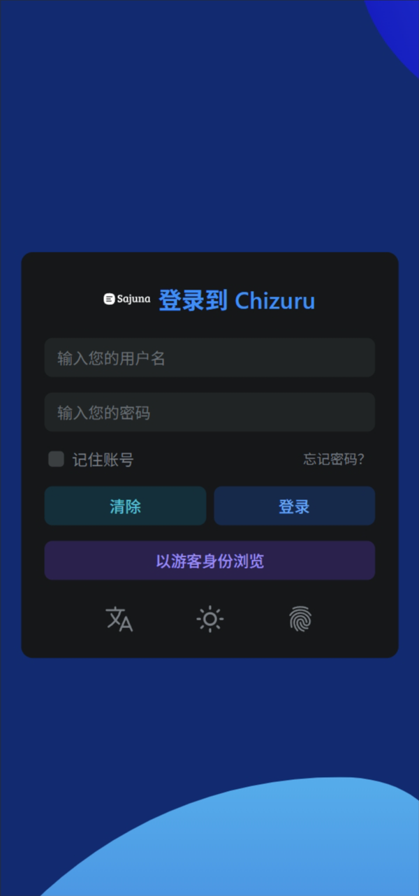

## 🎨 AList Moe

**为AList全局注入半透明模糊效果，支持日夜切换，覆盖文件列表/预览/后台等全组件**
> 一个基于文件列表程序AList的美化

## ✨ 特性

#### 🌓 兼容日/夜间模式 - 不同背景与配色

#### 🪟 全元素毛玻璃效果 - 半透明元素结合背景模糊

#### 🎨 多层次透明度调校 - 完美的视觉层次

## 🖼️ 截图 


<p align="center">
  
  
</p>

<p align="center">
  
  
</p>

<p align="center">
  
  
</p>
<p align="center">
  
  
</p>

## 🚀 使用  

### 自定义头部
```
<!-- 更改href和font-family以更改字体，删除本link或留空href则使用AList默认字体 -->
<link href="https://fonts.googleapis.com/css2?family=Noto+Serif+SC:wght@500&display=swap" rel="stylesheet">
<link href="https://gcore.jsdelivr.net/gh/SajunaOo/AList-Moe@v1.13-beta.5/css/AList-Moe.min.css" rel="stylesheet">
<style>
/** 更改url以更改背景图，删除本css或留空url将调用默认背景图 */
:root {
  --moe-theme-color: 248, 179, 78; /* 必填 该主题色用于修复视图切换按钮背景色 */
  --moe-bg-image: url("https://gcore.jsdelivr.net/gh/SajunaOo/AList-Moe/img/background_light.webp"); /* 白天模式背景图 */
}

.hope-ui-dark {
  --moe-bg-image: url("https://gcore.jsdelivr.net/gh/SajunaOo/AList-Moe/img/background_dark.webp"); /* 夜间模式背景图 */
}

* {
  font-family: 'Noto Serif SC';
  font-weight: 500;
  font-style: normal;
}

</style>
```

### 自定义内容

```
<script src="https://gcore.jsdelivr.net/gh/SajunaOo/AList-Moe@v1.13-beta.5/js/AList-Moe.min.js"></script>

<div id="beian-container" hidden>
  <a href="https://beian.miit.gov.cn" target="_blank" rel="noopener" class="beian-link ">
    豫 ICP 备 2025000000 号</a>
</div>

<script>
// 备案信息加载
(()=>{const targetNode=document.documentElement;const insertElement=()=>{const footer=document.querySelector('.footer');if(footer){const container=document.getElementById('beian-container');footer.append(container);container.hidden=false;return true}return false};const observer=new MutationObserver(()=>{if(insertElement()){observer.disconnect()}});observer.observe(document,{childList:true,subtree:true})})();
</script>

```

## 🙏 致谢

[AList](https://github.com/alist-org/alist)  
[安稳](https://anwen-anyi.github.io)   
[kasuie](https://github.com/kasuie/alist-customize)