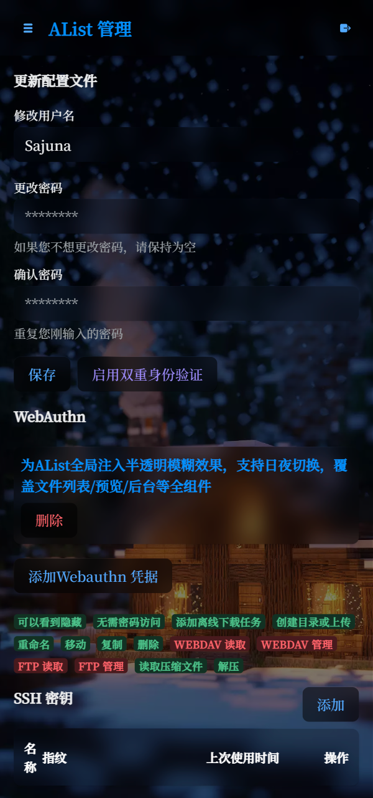

## 本项目已停更，请前往[OpenList Moe](https://github.com/SajunaOo/OpenList-Moe)

## 🎨 AList Moe

**为AList全局注入半透明模糊效果，支持日夜切换，覆盖文件列表/预览/后台等全组件**

> 一个基于文件列表程序AList的美化

## ✨ 特性

#### 🌓 兼容日/夜间模式 - 不同背景与配色

#### 🪟 全元素毛玻璃效果 - 半透明元素结合背景模糊

#### 🎨 多层次透明度调校 - 完美的视觉层次

## 🖼️ 截图


<p align="center">
  
  
</p>

## 🚀 使用

### 自定义头部

```
<!-- 更改href和font-family以更改字体，删除本<link>和字体css则使用AList默认字体 -->
<link href="https://fonts.googleapis.com/css2?family=Noto+Serif+SC:wght@600&display=swap" rel="stylesheet">
<link href="https://gcore.jsdelivr.net/gh/SajunaOo/AList-Moe@v1.14/dist/css/AList-Moe.min.css" rel="stylesheet">
<style>
/** 更改url以更改背景图，删除本css或留空url将调用默认背景图API */
:root {
  --moe-theme-color: 248, 179, 78; /** 必填 该主题色用于修复视图切换按钮背景色 */
  --moe-bg-image: url("https://api.sajuna.moe/image?type=light");/** 默认白天模式背景图API */
  --moe-bg-image-small: url("https://api.sajuna.moe/image?type=light_small");/** 默认白天模式小屏背景图API */
}

.hope-ui-dark {
  --moe-bg-image: url("https://api.sajuna.moe/image?type=dark");/** 默认夜间模式背景图API */
  --moe-bg-image-small: url("https://api.sajuna.moe/image?type=dark_small");/** 默认夜间模式小屏背景图API */
}

/** 字体 */
body {
  font-family: 'Noto Serif SC' !important;
}
div.markdown-body {
  font-family: inherit;
}
</style>
```

### 自定义内容

```
<script src="https://gcore.jsdelivr.net/gh/SajunaOo/AList-Moe@v1.14/dist/js/AList-Moe.min.js"></script>

<div id="beian-container" hidden>
  <a href="https://beian.miit.gov.cn" target="_blank" rel="noopener" class="beian-link ">
    豫 ICP 备 2025000000 号</a>
</div>

<script>
// 备案信息加载
(()=>{const targetNode=document.documentElement;const insertElement=()=>{const footer=document.querySelector('.footer');if(footer){const container=document.getElementById('beian-container');footer.append(container);container.hidden=false;return true}return false};const observer=new MutationObserver(()=>{if(insertElement()){observer.disconnect()}});observer.observe(document,{childList:true,subtree:true})})();
</script>
```

## 🌠 API说明 

### 基础调用方式

**请求URL**: `/image`

**请求方法**: GET

**参数**:

- `type`: 图片类型（必填）
- `node`: CDN节点（可选）

**示例请求**:

```
GET /api?type=dark&node=jsd
```

### 图片类型(type)

| 类型值        | 描述             |
|---------------|------------------|
| `light`       | 浅色桌面壁纸     | 
| `dark`        | 深色桌面壁纸     |
| `light_small` | 浅色手机壁纸     |
| `dark_small`  | 深色手机壁纸     |

### CDN节点(node)

| 节点值    | 描述                  | 推荐场景          |
|-----------|-----------------------|-------------------|
| `eo` | Tencent EdgeOne CDN   | 中国大陆优化（默认） |
| `jsd`     | jsDelivr Mirror CDN   | 全球通用          |

### 状态查询

**URL**: `/status`

**方法**: GET

### 注意事项

1. API返回302重定向响应，直接使用URL即可获取图片
2. 图片URL会随机变化，每次请求获取不同的图片
3. 服务状态可通过`/status`端点查询
4. 如果未指定`node`参数，默认使用`EdgeOne`节点